Welcome to my Powershell repository!

I'll be sharing my scripts and functions here.

Let's start by explaining how to get started with PowerShell functions. Functions allow you to automate repetitive tasks by defining reusable blocks of code that act like your own commands.

### 1. Creating the PowerShell profile

In order to have a Powershell profile, you'll need a Powershell folder, a scripts folder and a .ps1 file containing your profile. This file will contain the startup instructions for Powershell, which allows you to perform custom actions when PowerShell starts — such as importing functions or setting preferences.

By default, your documents folder won't have anything related to Powershell:

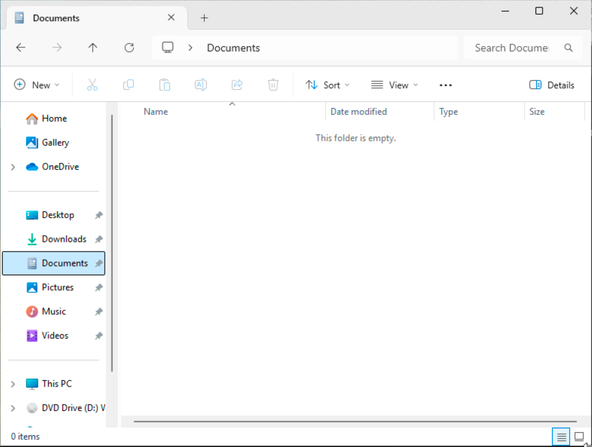

Let's change that.

First, we'll create the folder and the .ps1 file with the following command:

New-Item -Path $PROFILE -ItemType File -Force

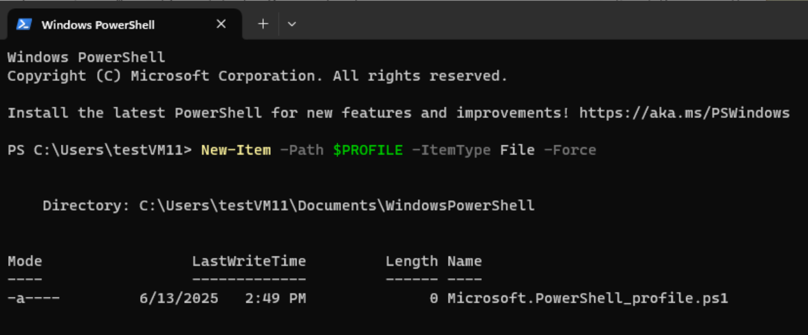

All good, the folder has been created as confirmed by the output, you should see this in your explorer:

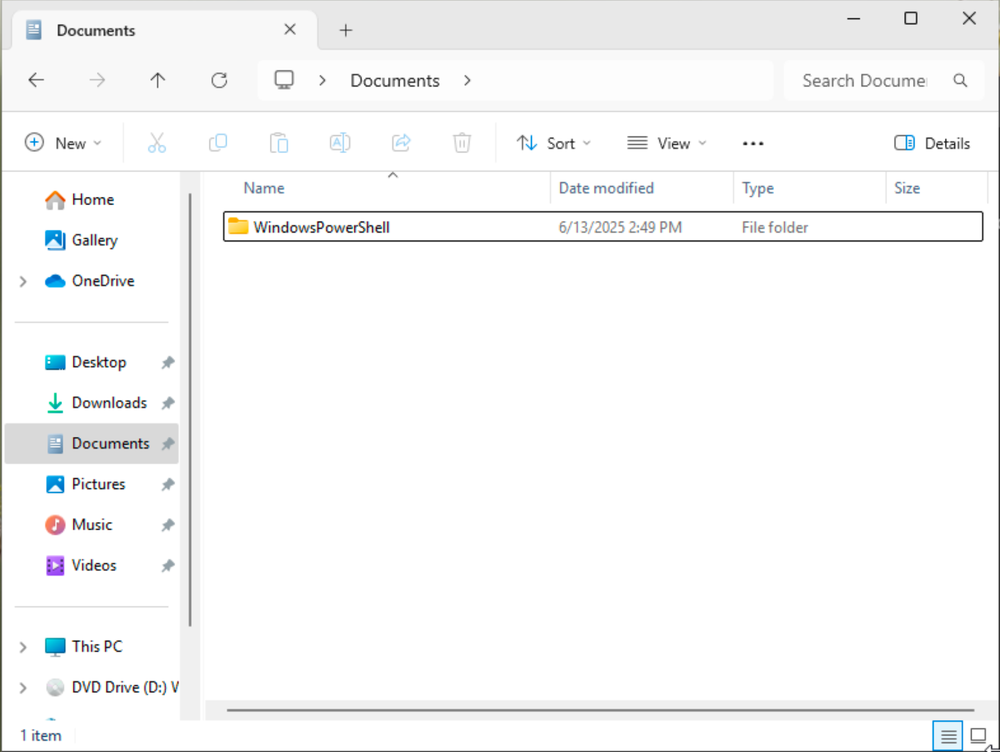

And this is the file it contains:

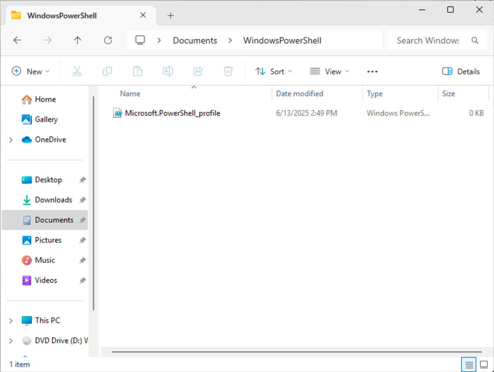

### 2. Creating the functions folder

Let's now create the folder where we'll place our functions:

New-Item -Path (Split-Path -Parent $PROFILE) -Name "Functions" -ItemType Directory -Force

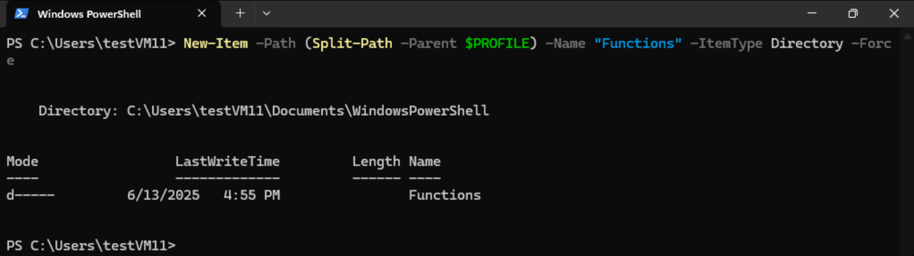

All good, you can now add your function files:

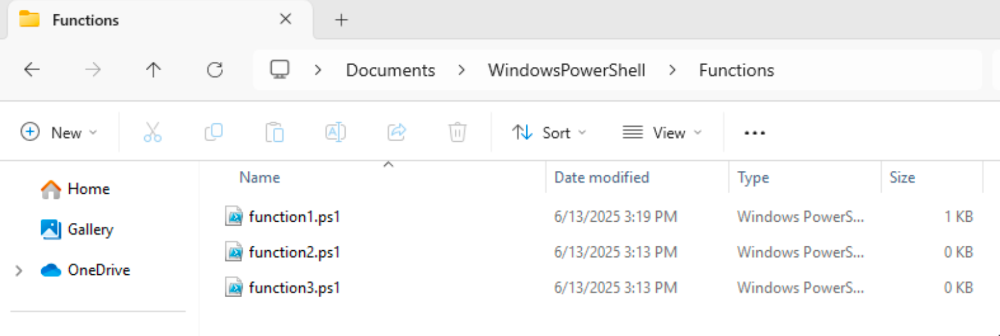

### 3. Editing the profile

Now we'll need to modify the profile so that it imports the functions contained in the folder created earlier at every startup. You'll find the profile.ps1 in this repo. You can add or remove anything you'd like.

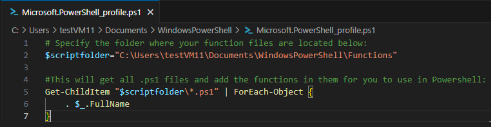

Once done, PowerShell will automatically run the code in your profile every time it starts.

### 4. Changing the execution policy

By default, Powershell blocks the execution of scripts, that includes functions. So, if you reopen Powershell, you might get the following error message:

"Cannot be loaded because running scripts is disabled on this system."

Simply change the execution policy as shown below:

Set-ExecutionPolicy RemoteSigned -Scope CurrentUser

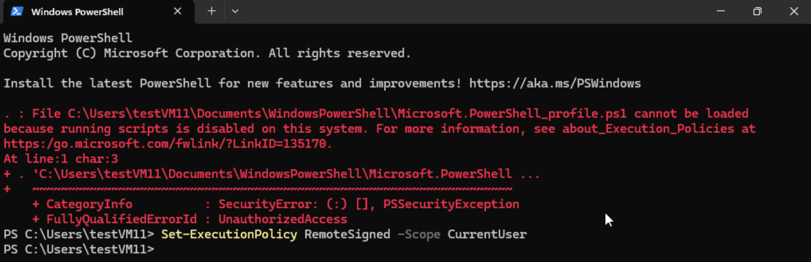

Note: 
Changing execution policy affects security and the typical recommendation is to set it to RemoteSigned or use Bypass only if you trust the scripts.

### 5. First function

Let's now create a function that we'll call function1 and that will simply say "Hello, today's date is" and show the date:

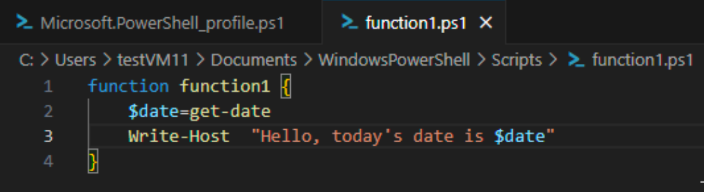

You can now save it and add it to the folder created before, and add more functions if you want to:

Now, either restart PowerShell to load your profile automatically, or run the following command to load it immediately without restarting:

. $profile 

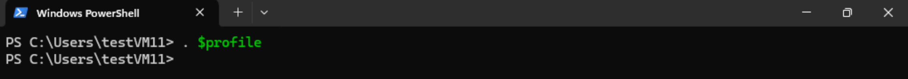

And now you can run your function1:

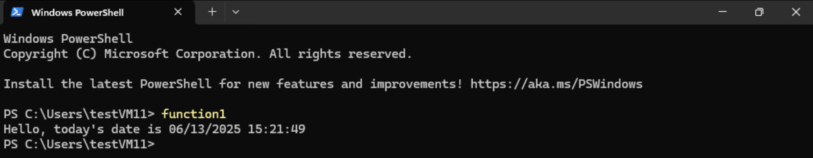
